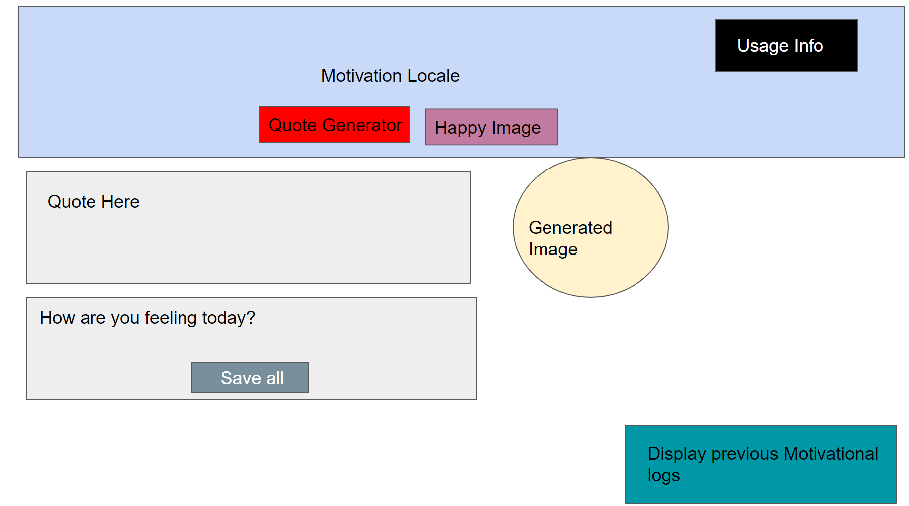

# Motiovation Locale
## Deployed Application
## Description
This application was created for users looking for some daily motivation to get through the day. The application randomely generates motivational quotes, images, and gives users the opportunities to write down their feelings and save all this to their motivational history page for when they want to read back all the images, quotes, and feelings they've saved.
## Features
- Randomly generated Happy images from Flickr Api.
- Randomly generated motivational quotes from Type.fit Api.
- Ability to save user feelings.
- Ability to display savings history.
## Technologies Used
- HTML: to display page and page strucute.
- CSS: to integrate styling to the application.
- Materialize: Integrate styling to the application.
- javascript: to add functionality and local storage.
## Wireframe

## Credits
### Nathan Kryzanowski
- https://github.com/NathanKryz
### Esra Al-Abduljavar
- https://github.com/EsraWameed
### Salman
- https://github.com/456salman
